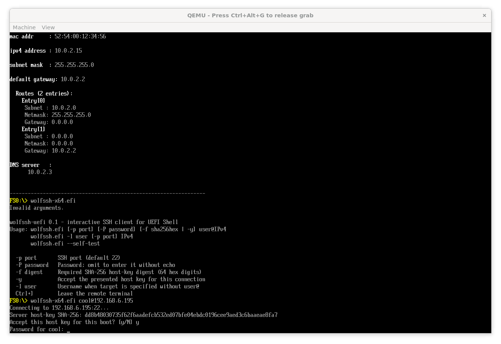
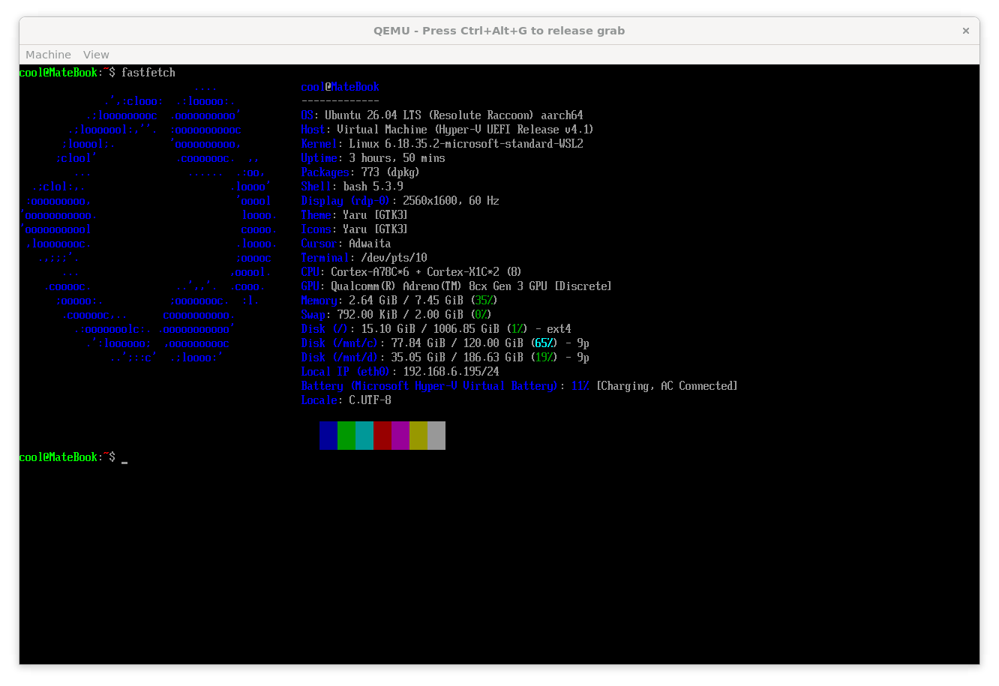
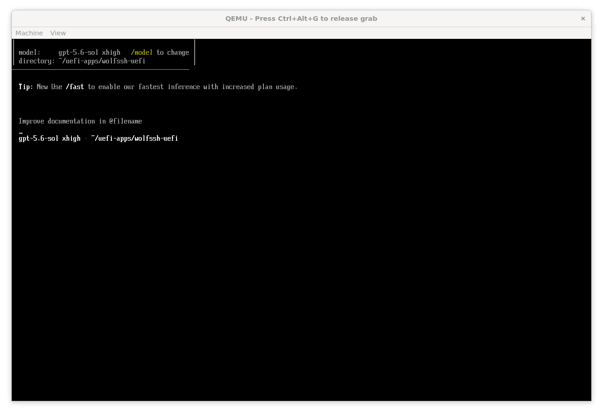
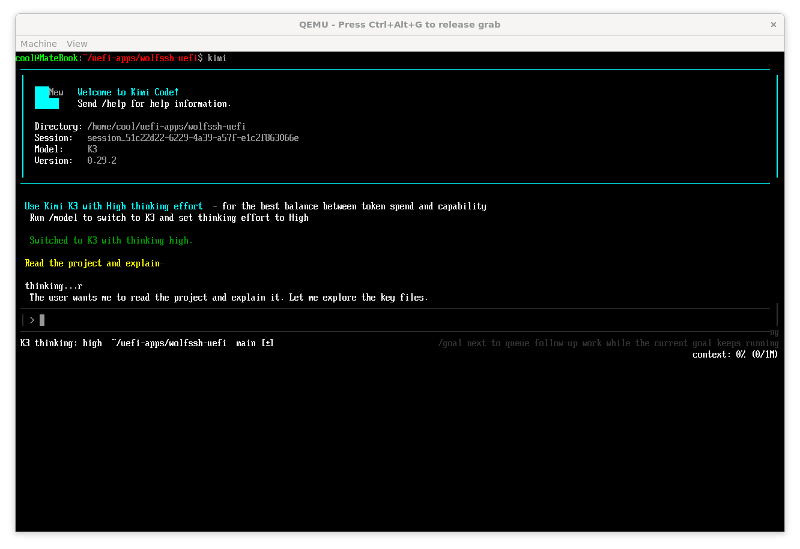

# wolfSSH UEFI Shell Client

[English](README.md)

这是一个可运行的 AARCH64（ARM64）与 X64（x86-64）UEFI Shell SSH 客户端原型。
它把 wolfSSH 客户端、wolfCrypt 和 EDK II 的原生 TCP4 协议直接链接进 EFI 应用，
不依赖 POSIX、BSD socket 或 UEFI 之外的运行时。

两个架构都已经在 QEMU 中完成真实的 SSH 握手和双向 PTY 测试。它不只是执行一条
远端命令：连接建立后会进入交互式终端，可运行 shell、编辑器和常见文本 TUI。
终端兼容范围与已知限制见下文。



## 运行截图

在 UEFI Shell 中建立 SSH 连接后，客户端可运行常见命令行程序和交互式终端应用。

### Fastfetch


### Codex CLI


### Kimi Code CLI


## 项目来源与 AI 协作

本项目由仓库所有者提出目标、需求和验收方向，首版实现由 OpenAI ChatGPT
（Codex）在协作过程中完成，包括方案设计、wolfSSH/wolfCrypt 移植、EDK II TCP4
接入、终端模拟、构建脚本以及 QEMU 端到端验证。该说明不代表 OpenAI 对项目提供
官方支持或安全背书；AI 生成的实现仍应接受代码审查、实体固件测试和安全审计。

The initial implementation was designed, written, built, and validated end-to-end by
ChatGPT (Codex), under the repository owner's direction.

## 已实现

| 部分 | 实现 |
|---|---|
| 架构 | AARCH64 与 X64；分别发布 `wolfssh-aarch64.efi` 和 `wolfssh-x64.efi` |
| 网络 | 直接使用 `EFI_TCP4_SERVICE_BINDING_PROTOCOL` / `EFI_TCP4_PROTOCOL`；枚举网卡、检测媒体、异步接收、带超时发送与关闭 |
| 地址配置 | 与 `iperf3-uefi` 的 TCP4 路径一致：`UseDefaultAddress=TRUE`，等待 `EFI_NO_MAPPING` 消失，使用固件已有的 DHCP 或静态 IPv4 映射 |
| SSH | wolfSSH 客户端、密码认证、PTY 和交互式 shell channel |
| 随机数 | 只接受 `EFI_RNG_PROTOCOL`；协议不可用时拒绝建立 SSH 会话 |
| 主机密钥 | 显示 SHA-256 十六进制摘要；支持交互确认、`-f` 精确固定、`-y` 单次不安全接受 |
| 输出终端 | UTF-8（BMP）、光标移动/定位、清屏/清行、滚动区域、插入/删除行和字符、保存光标、16 色及 256/RGB 到 16 色近似、主/备用屏幕、光标显隐 |
| 双向终端 | DSR/设备状态回应，方向键、Home/End、Insert/Delete、PageUp/PageDown、F1–F10，应用光标模式 |
| 本地退出 | `Ctrl+]` 返回 UEFI Shell |

当前加密互操作配置为：

- KEX：`ecdh-sha2-nistp256`
- 主机密钥：`ecdsa-sha2-nistp256`
- 加密：AES-128/192/256 GCM 和 CTR
- MAC：`hmac-sha2-256`（GCM 为 AEAD）
- 用户认证：password

这组算法可连接保留 ECDSA P-256 主机密钥的常规 OpenSSH 服务器；只允许
Ed25519、RSA 或 Curve25519 的定制服务器目前无法协商。

## 快速构建

在 x86-64 Linux 上，先拉取锁定版本的源码。`ARCH=ALL` 会准备 AARCH64 工具、
两个架构的 UEFI Shell 和测试所需的 Python 包：

```bash
./scripts/fetch-deps.sh
ARCH=ALL ./scripts/fetch-tools.sh

ARCH=AARCH64 BUILD_TARGET=RELEASE ./scripts/build.sh
ARCH=X64 BUILD_TARGET=RELEASE ./scripts/build.sh
```

只构建 X64 时可把工具准备命令改成 `ARCH=X64 ./scripts/fetch-tools.sh`。输出文件为：

```text
.build/output/wolfssh-aarch64.efi
.build/output/wolfssh-x64.efi
```

每次构建还会把刚生成的架构复制为 `.build/output/wolfssh.efi`，供已有自动化兼容使用；
发布或复制到 ESP 时应优先使用带架构后缀的文件。

源码和工具的提交、下载地址及 SHA-256 全部记录在 `deps.lock`。默认目录布局是：

```text
parent/
├── wolfssh-uefi/
├── upstream/
└── toolchains/
```

构建脚本会对最终副本执行 EDK II `GenFw -z`，清除 PE 调试目录中的绝对构建路径和
时间字段。AARCH64 使用锁定的交叉编译器；X64 使用主机 GCC/binutils/NASM，因此跨
主机复现 X64 二进制时还应保持这些工具的版本一致。

如已安装自己的 EDK II 或工具链，可设置：

```bash
EDK2_ROOT=/path/to/edk2 \
AARCH64_TOOLCHAIN_ROOT=/path/to/xpack-aarch64-none-elf-gcc-15.2.1-1.1 \
ARCH=AARCH64 BUILD_TARGET=RELEASE ./scripts/build.sh

EDK2_ROOT=/path/to/edk2 \
ARCH=X64 BUILD_TARGET=RELEASE ./scripts/build.sh
```

主机构建至少需要 Bash、Git、Python 3、GNU Make、主机 C 编译器、`curl`、`tar`、
`sha256sum` 和 EDK II BaseTools 所需的 UUID 开发库。X64 构建还要求主机提供 GCC、
GNU binutils 和 NASM；X64 QEMU 测试要求 `qemu-system-x86_64` 与 OVMF。锁定的
AARCH64 预编译工具是 Linux x86-64 版本；其他主机请手动准备同等工具并使用上述
环境变量。

## 在 UEFI Shell 中使用

选择与固件架构匹配的文件复制到 ESP 或 U 盘。常见 PC 固件通常使用 X64，ARM64
设备使用 AARCH64；UEFI 不会运行架构不匹配的 EFI 文件。可以保留发布文件名，也可
将它重命名为 `wolfssh.efi`，然后在 UEFI Shell 中运行：

```text
fs0:\wolfssh.efi user@192.0.2.10
```

非默认端口：

```text
fs0:\wolfssh.efi -p 2222 user@192.0.2.10
```

首次连接会显示主机密钥摘要并要求确认。正式使用建议从服务器可信侧计算摘要：

```bash
awk '{print $2}' /etc/ssh/ssh_host_ecdsa_key.pub | base64 -d | sha256sum
```

然后固定它：

```text
fs0:\wolfssh.efi -f 64位十六进制SHA256 user@192.0.2.10
```

没有 `-P` 时密码输入不回显。`-P password` 只适合自动化测试，因为密码会出现在
UEFI Shell 参数和可能的命令历史中。`-y` 也只应在测试环境使用，它仅对当前连接
接受未固定的主机密钥。

客户端使用固件的默认 IPv4 映射。真实机器必须先加载 NIC、SNP/MNP、IPv4 和 TCP4
驱动，并让固件通过 DHCP 或静态配置得到地址；若 Shell 带 `ifconfig`，可先用它确认
接口状态。应用不会自行实现网卡驱动或 DHCP 客户端，而是复用固件网络栈。

内置终端自检：

```text
fs0:\wolfssh.efi --self-test
```

## QEMU 端到端测试

```bash
ARCH=AARCH64 ./scripts/test-qemu.sh
ARCH=X64 ./scripts/test-qemu.sh
```

测试脚本会：

1. 构建所选架构的 RELEASE EFI 应用；
2. 生成一次性 ECDSA P-256 主机密钥，并启动只允许目标算法和测试密码的 AsyncSSH 服务端；
3. 通过一个无特权 QEMU stream 后端提供 DHCP、ARP 和单连接 TCP 转发；
4. 启动对应架构的 QEMU/EDK II/UEFI Shell；
5. 验证 `-f` 精确固定当次临时主机密钥、密码认证、PTY 尺寸、shell channel、颜色、擦除、光标定位和双向 DSR 回应；
6. 要求远端会话以状态 0 关闭。

AARCH64 测试使用脚本下载并校验的 QEMU/固件；X64 测试使用主机安装的 QEMU 与
OVMF。日志分别写入 `.build/test-results/aarch64/` 和 `.build/test-results/x64/`。

该网络代理仅用于可重复测试，不是通用用户态网络栈。真实固件运行时使用
`Tcp4.c` 中的 EDK II TCP4 路径。

已验证的版本、二进制摘要和测试标记见 `QEMU_VALIDATION.md`。

## 终端兼容边界

清屏是可行的：远端的 `ESC[2J` 会被解析为 UEFI
`EFI_SIMPLE_TEXT_OUTPUT_PROTOCOL.ClearScreen()`，其他常见 ANSI/VT 序列会映射为
UEFI 光标、颜色和屏幕缓冲操作。

当前不是完整 xterm：

- 不支持鼠标、剪贴板、六像素图形或 bracketed paste；
- 不在会话中动态上报控制台尺寸变化；
- 24 位和 256 色会近似到 UEFI 16 色；
- 非 BMP Unicode 会显示为 `?`，CJK/组合字符宽度按单格处理；
- OSC 标题等序列会安全忽略；
- 只支持 IPv4 字面量，没有 DNS 和 IPv6；
- 没有持久 `known_hosts`，重启后需再次确认或使用 `-f`；
- AARCH64 与 X64 EFI 文件均未签名，启用 Secure Boot 的机器可能拒绝加载。

因此，普通 shell、`top`/`htop`、`vim`/`nano`、菜单式 TUI 等基本交互具备实现基础，
但高度依赖完整 xterm、鼠标或精确 Unicode 宽度的程序仍可能显示不完整。本项目尚未
经过安全审计，不应直接用于不可恢复的生产维护操作。

## 目录

```text
WolfSshPkg/Application/WolfSsh/  CLI、认证、TCP4、会话循环、终端模拟器
WolfSshPkg/Library/              UEFI libc 兼容层、wolfCrypt/wolfSSH EDK II 库
WolfSshPkg/Include/              wolfSSL 用户配置与库接口
patches/                         wolfSSH 在 NO_FILESYSTEM 下启用 UEFI PTY 的补丁
scripts/                         依赖、工具、构建和 QEMU 回归脚本
tests/                           确定性 SSH 服务端和 QEMU 测试网络代理
```

## 致谢

- [ChatGPT(Codex)](https://openai.com/chatgpt/overview/)：项目的完整设计、实现、构建与端到端验证。
- [wolfSSH](https://github.com/wolfSSL/wolfssh) 与 [wolfSSL / wolfCrypt](https://github.com/wolfSSL/wolfssl)：提供 SSH 客户端和密码学实现。
- [tianocore/edk2](https://github.com/tianocore/edk2)：提供 UEFI 构建基础设施、库与网络协议接口。
- [BigfootACA/iperf3-uefi](https://github.com/BigfootACA/iperf3-uefi)：为 TCP4 生命周期和默认 IPv4 映射提供设计参考。
- [QEMU](https://www.qemu.org/)、[OVMF](https://github.com/tianocore/edk2/tree/master/OvmfPkg) 与 [AsyncSSH](https://github.com/ronf/asyncssh)：支持端到端验证。

## 许可证

默认构建链接 GPLv3 版 wolfSSH/wolfSSL，因此本发布包按 GPLv3 提供。wolfSSH 和
wolfSSL 也提供商业许可；如需走商业许可路线，应单独向 wolfSSL Inc. 确认许可条件。
详见 `LICENSE` 和 `THIRD_PARTY_NOTICES.md`。
